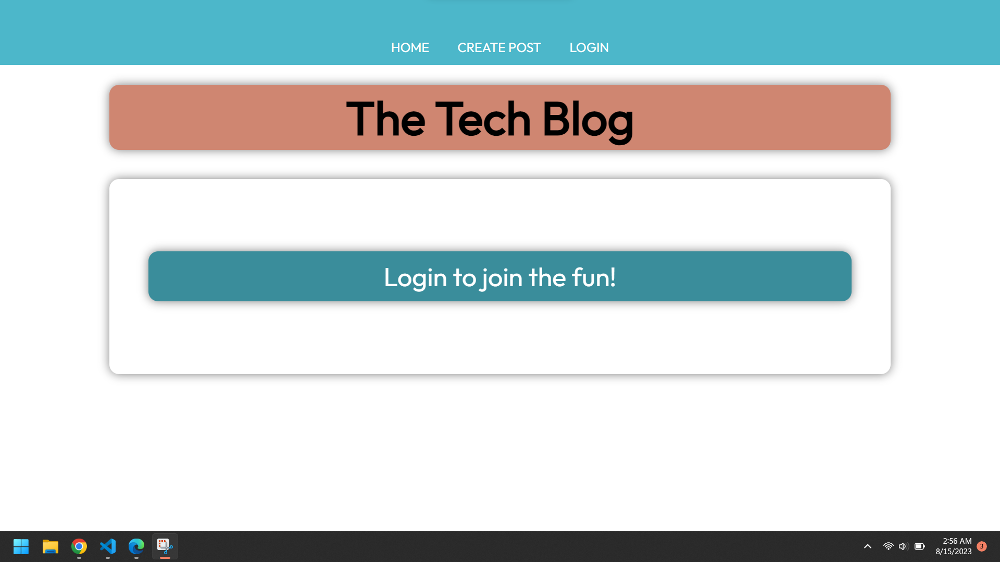
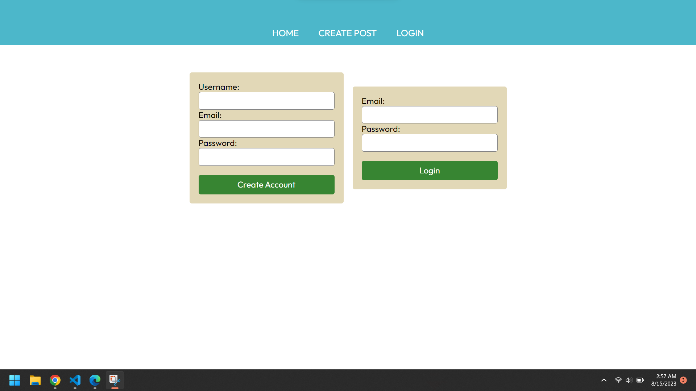
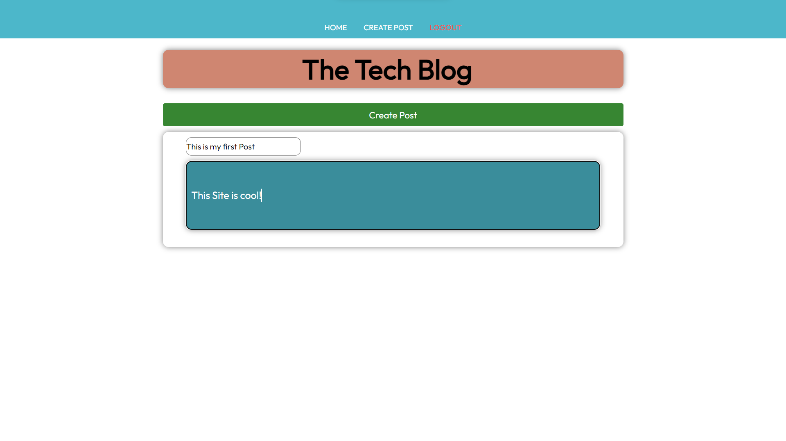
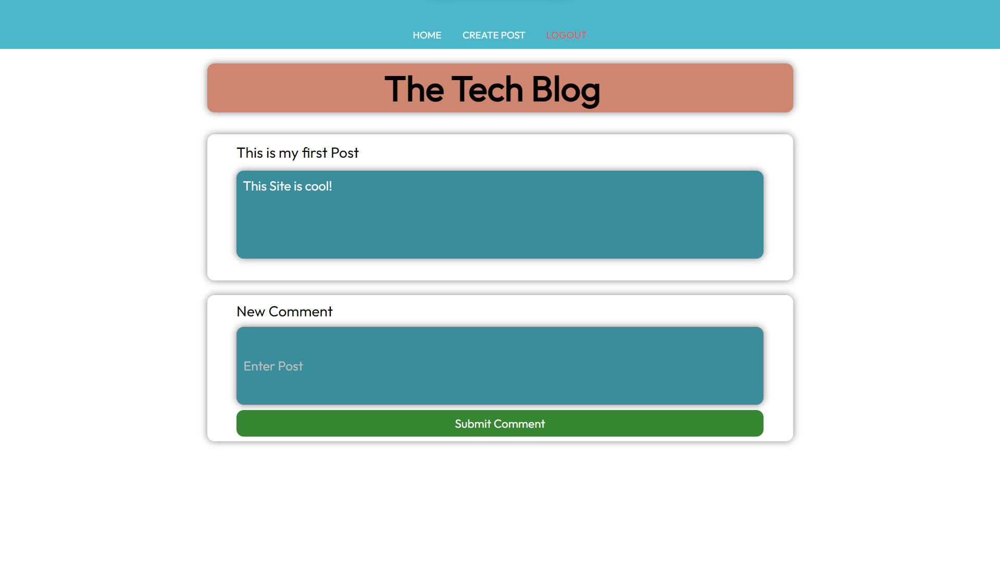

# Tech-Blog

https://the-technology-blog-1a45bd1d041b.herokuapp.com/

# Welcome to my Blog Website!
my blog website is a platform for users to share their thoughts, opinions, and experiences with others. Here, you can create an account, comment on posts, and even create your own posts.

1. [Features](#features)

2. [Authors](#authors)

3. [Usage](#usage)
    
4. [Features](#features)

5. [Demo](#demo)

## Features

**Create an account:** Sign up for a free account to access all the features of my website.

**Comment on posts:** Join the conversation by leaving comments on posts that interest you.

**Create your own posts:** Share your thoughts and experiences with others by creating your own posts.

## Getting Started
To get started, simply click on the “Sign Up” button to create a free account. Once you have an account, you can start exploring the site, leaving comments on posts, and even creating your own posts.

We hope you enjoy using my blog website and look forward to seeing your contributions! 😊

Node.js and Express.js - to create my API
MYSQL and Sequelize ORM - to create my database of cats, and users
Express sessions and cookies - for authentication and store data
Handlebars - to render the information
HEROKU - to deploy my web page 
Figma - for planning

## Author

-[@Sergrojas29](https://github.com/Sergrojas29) | Sergio Rojas-Aguilar

## Usage

## Features

We were able to implement user acount using mysql and and securly login in with session and hashing passwords before the reached out server.

Even were able to get a redirect to login before being able to login to view my all other users posts

Create a new account

You can create a post!

You can commnet on others or your own posts
You can delete only your own posts NOT others.

## Demo

<!--  -->

